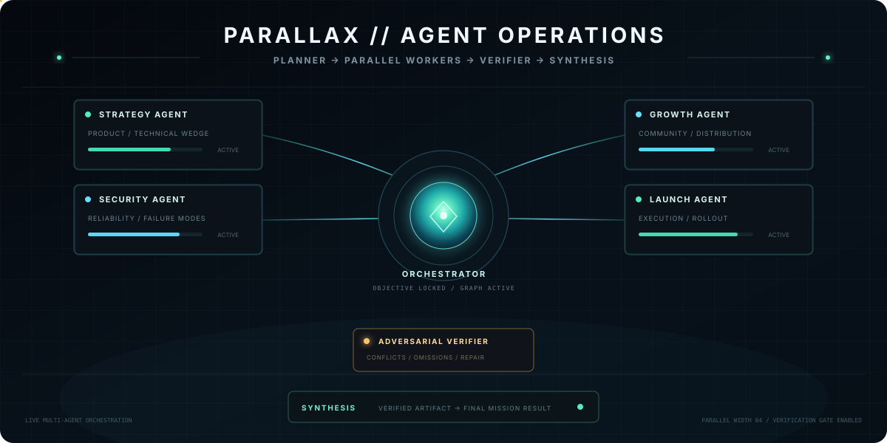
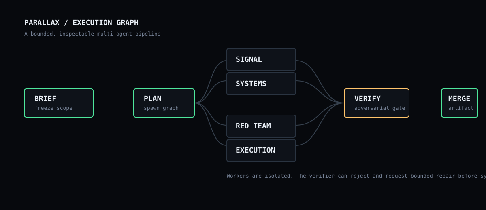

<p align="center">
  
</p>

<p align="center"><strong>One objective. A graph of specialists. A verified artifact.</strong></p>

<p align="center">
  <code>DEMO MODE</code> · <code>LIVE AI</code> · <code>PARALLEL AGENTS</code> · <code>ADVERSARIAL VERIFICATION</code>
</p>

PARALLAX is a zero-dependency multi-agent operations console built to make orchestration visible instead of hiding it behind a chat box. It turns one mission into a bounded graph: **scope lock → planning → parallel specialists → adversarial verification → synthesis**.

The animated hero above mirrors the runtime model: a planner decomposes the objective, specialist agents execute independent work in parallel, a verifier audits the combined artifacts, and synthesis publishes the final result.

## Why it exists

Most agent demos optimize for the amount of work an agent appears to do. PARALLAX optimizes for **separation of concerns, inspectability, and bounded failure**.

The system intentionally keeps the lead planner separate from execution, runs specialists with isolated instructions, and inserts a dedicated verification gate before the final result is released.

## Execution graph



```text
OBJECTIVE
   │
   ▼
 BRIEF
   │
   ▼
 PLAN
 ├────────► SIGNAL
 ├────────► SYSTEMS
 ├────────► RED TEAM
 └────────► EXECUTION
              │
       parallel artifacts
              │
              ▼
           VERIFY
              │
        pass / repair
              │
              ▼
          SYNTHESIS
              │
              ▼
           ARTIFACT
```

## What works

- **Interactive mission-control UI** with an animated SVG execution graph.
- **Deterministic Demo mode** with no API key or dependencies.
- **Real AI mode** using the OpenAI Responses API from the server only.
- **Dynamic planning** into 2–4 independent specialist tasks.
- **Parallel worker execution** with isolated role prompts.
- **Adversarial verifier** that audits contradictions, missing constraints, duplication, and unsupported claims.
- **Final synthesis** that uses both specialist artifacts and the verifier audit.
- **Node inspector** for assignments, dependencies, status, confidence, duration, attempts, and artifacts.
- **Execution trace** showing each stage of a run.
- **Bounded UI repair simulation** to demonstrate reject → repair → verify behavior.
- **Local-first development server** written with Node's standard library.
- **Vercel serverless endpoint** for `/api/run`.
- **No client-side secrets**. `OPENAI_API_KEY` stays on the server.
- **Zero npm dependencies** for the application itself.

## Run locally

Requirements: **Node.js 22+**.

```bash
cp .env.example .env
npm run dev
```

Open:

```text
http://localhost:3000
```

Demo mode is immediately available. No key is required.

## Enable Live AI mode

Add an API key to `.env`:

```env
OPENAI_API_KEY=your_key_here
OPENAI_MODEL=gpt-5.6-luna
```

Restart the local server and switch the UI from **DEMO** to **LIVE AI**.

The model can be changed through `OPENAI_MODEL`. A cost-conscious model is used by default; harder missions can be routed to a stronger model.

## Real AI execution flow

1. The server freezes the submitted objective.
2. The Planner returns a JSON plan with 2–4 specialist roles.
3. All specialist requests are sent in parallel with `Promise.all`.
4. A separate Verifier audits the combined artifacts.
5. A Synthesizer resolves the verified material into the final response.
6. The browser replays the resulting graph and exposes every artifact in the inspector.

The browser never receives or stores `OPENAI_API_KEY`.

## Project structure

```text
parallax-agent-ops/
├── api/
│   └── run.js                 # Vercel serverless AI endpoint
├── assets/
│   ├── architecture.svg
│   ├── parallax-agents-live.svg # animated README hero
│   ├── parallax-logo.svg        # project identity
│   └── parallax-hero.svg
├── lib/
│   └── orchestrator.js        # Planner / workers / verifier / synthesis
├── test/
│   └── orchestrator.test.js
├── .github/workflows/ci.yml
├── .env.example
├── .gitignore
├── app.js                     # graph state + interactions
├── index.html
├── LICENSE
├── package.json
├── scripts/
│   └── local-server.js        # local zero-dependency dev server
├── styles.css
└── vercel.json
```

## Verification

```bash
npm run check
npm test
```

The repository includes syntax checks and Node unit tests. GitHub Actions runs both on push and pull request.

## Deploy to Vercel

1. Push this repository to GitHub.
2. Import it into Vercel.
3. Add `OPENAI_API_KEY` and optionally `OPENAI_MODEL` as environment variables.
4. Deploy.

The static interface is served directly by Vercel's CDN and `/api/run` is handled by the Vercel Function in `api/run.js`. The local HTTP server lives under `scripts/` so Vercel does not detect it as the production app entrypoint.

## Design principles

**Graph before prose.** The workflow is visible as a topology rather than a stream of chat messages.

**Planner ≠ worker.** The lead decides what work exists but does not perform specialist work.

**Parallel when independent.** Workers only run concurrently when their responsibilities do not depend on each other's output.

**Verification is a separate authority.** The agent doing the work is not the final judge of whether the work is acceptable.

**Bound failures.** Retries are not infinite. A production extension should persist retry budgets and move irrecoverable runs into a HOLD state.

**Artifacts over hidden reasoning.** PARALLAX stores useful outputs, statuses, and audits rather than exposing private chain-of-thought.

## Production extensions

The repository is deliberately compact. For a production deployment, the next layers would be:

- SSE/WebSocket event streaming from the orchestrator instead of browser-side replay.
- Durable run state in Postgres/SQLite.
- Queueing for long-running missions.
- Tool permissions per agent.
- Retrieval and file-search workers.
- Human approval gates for consequential actions.
- Per-agent model routing and token budgets.
- Persistent benchmark and evaluation suites.
- Tracing via OpenTelemetry.
- Authentication and per-user rate limits.

## Inspiration

The interaction model is inspired by contemporary graph-engineering discussions around dynamically decomposed multi-agent workflows. PARALLAX is an independent implementation and design, not a clone of another project's interface or code.

## License

MIT
