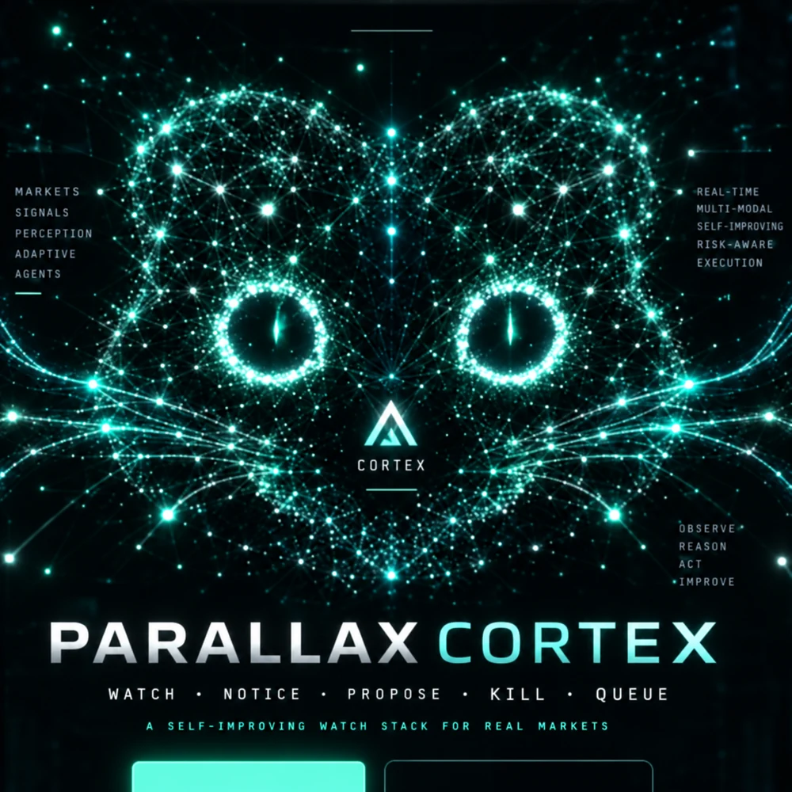
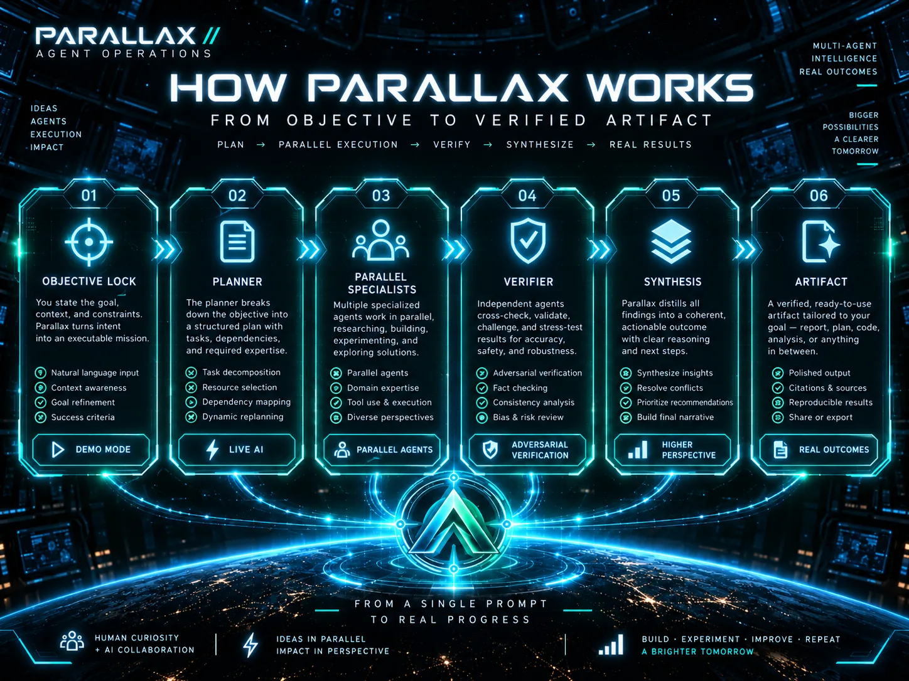
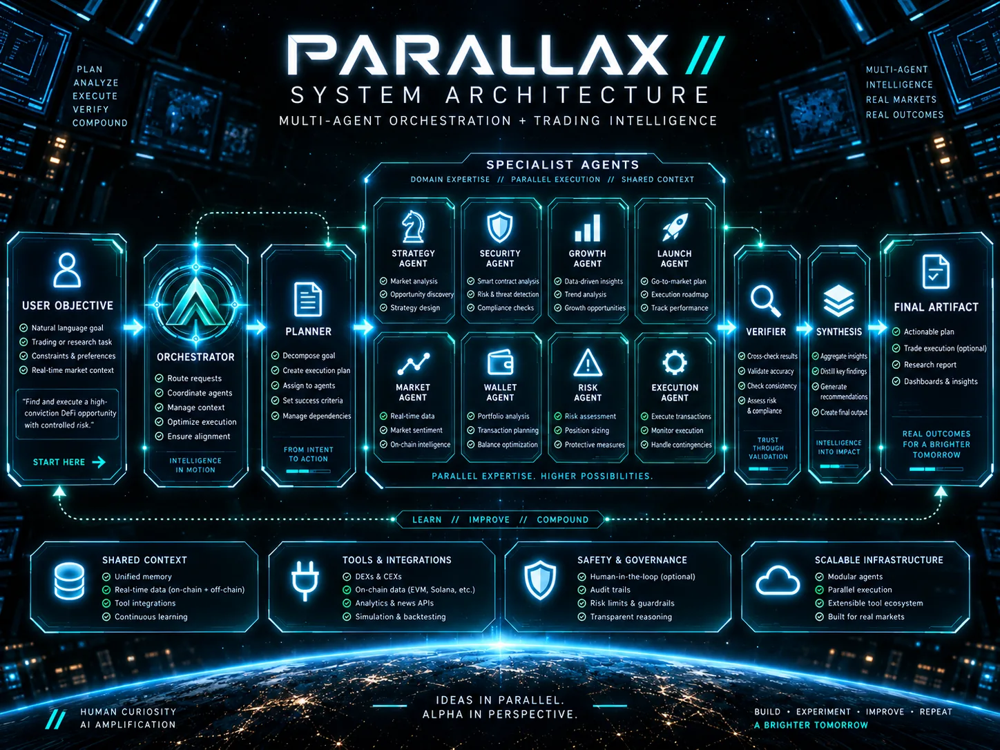
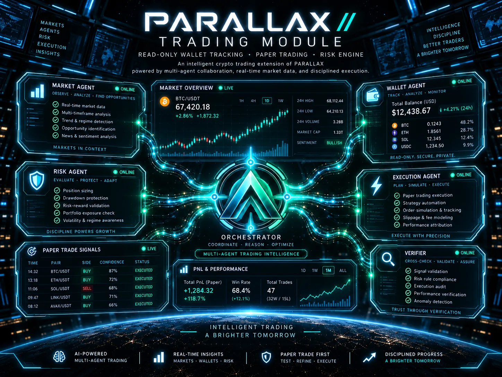

<p align="center">
  
</p>

<p align="center"><strong>Watch. Notice. Propose. Kill. Queue.</strong></p>

<p align="center">
  <code>DEMO MODE</code> · <code>LIVE AI</code> · <code>PARALLEL AGENTS</code> · <code>CRYPTO INTELLIGENCE</code> · <code>PARALLAX CORTEX</code>
</p>

PARALLAX is a zero-dependency multi-agent operations console that makes orchestration visible instead of hiding it behind a chat box. A mission is decomposed by a planner, executed by independent specialists, audited by a separate verifier, and merged into a final synthesis.

PARALLAX now also includes a **guarded autonomous paper-trading agent**: public market data, read-only Solana wallet observation, automatic market scans, local paper positions, stop/take-profit simulation, risk limits, and one-click routing of the current trading snapshot into the agent graph.

## How PARALLAX works

<p align="center">
  
</p>

> Visual explainer. The runtime UI remains the source of truth for current behavior.

```text
OBJECTIVE → BRIEF → PLAN
                    ├─ SPECIALIST 1
                    ├─ SPECIALIST 2
                    ├─ SPECIALIST 3
                    └─ SPECIALIST 4
                          ↓
                       VERIFY
                          ↓
                      SYNTHESIS
                          ↓
                       ARTIFACT
```

## System architecture

<p align="center">
  
</p>

Planning, execution, verification, and synthesis are separate stages. Trading context can be routed into the same graph without giving the application custody or signing authority.

## PARALLAX CORTEX

<p align="center">
  
</p>

**PARALLAX CORTEX** is the visual persona of the autonomous trading agent. The live site uses this artwork as a reactive character rather than a static mascot: it wakes when the agent starts, scans while WATCH / NOTICE is active, changes state at the KILL risk gate, and flashes when a paper action reaches QUEUE.

The character is connected to the same observable event pipeline shown in the interaction stream. It represents structured system state and visible actions, not hidden chain-of-thought.

### Living CORTEX animation

CORTEX is intentionally **alive even while idle**:

- continuous subtle head sway and breathing glow
- natural synchronized eye blinks on a permanent loop
- ambient neural-particle drift
- slight pointer-aware gaze / head parallax in the homepage hero
- stronger scan animation during **WATCH / NOTICE**
- amber risk response during **KILL**
- red visual veto state when blocked
- intensified teal pulse during **QUEUE / EXECUTE**

The animation is implemented with lightweight CSS and small pointer-state updates; no video file or animation runtime is required.

## Trading Module

<p align="center">
  
</p>

<sub>Concept visual; displayed balances, prices, PnL, and trade statistics in the artwork are illustrative.</sub>

The live implementation is intentionally bounded:

- **Live public market data** for BTC, ETH, and SOL.
- **Provider fallback** from CoinGecko to Coinbase public market statistics.
- **Read-only Solana wallet observation** using only a public address and `getBalance`.
- **Local paper portfolio** persisted in browser `localStorage`.
- **BUY / SELL paper positions** with simulated entry, mark-to-market PnL, stop loss, and take profit.
- **Risk engine** with a 20% single-position cap, 60% total-exposure cap, and no leverage.
- **Automatic paper stop / take-profit checks** when fresh market data arrives.
- **Autonomous Paper Agent** that begins scanning as soon as the user presses Start.
- **Live Agent Interaction** view that exposes the actual observable pipeline in real time: WATCH → NOTICE → PROPOSE → KILL → QUEUE.
- The interaction stream shows market observations, candidate proposals, risk vetoes/approvals, and paper actions without exposing hidden chain-of-thought.
- **Automatic candidate selection** from BTC, ETH, and SOL using the strongest eligible 24h momentum.
- **Autonomous risk-gated execution** at 10% of paper equity per entry, max 2 open autonomous positions, 10-minute per-asset cooldown, 2.5% stop loss, and 5% take profit.
- **Start / Stop controls, scan cadence, countdown, session trade count, last decision, and live decision log.**
- **Trading agent monitor** for market regime, autonomous execution state, exposure, and execution boundary.
- **Route Snapshot to Agent Graph** to turn live market context and the paper portfolio into a normal PARALLAX mission.

### Security boundary

PARALLAX Trading does **not** contain:

- seed phrase handling
- private-key handling
- wallet signing
- token approvals
- live-order submission
- autonomous fund movement

A public wallet address can be inspected, but it cannot authorize a transaction. The application never asks for a seed phrase or private key.

## What works

- Interactive mission-control UI with animated execution graph.
- Deterministic **Demo mode** with no API key.
- **Live AI mode** through the server-side OpenAI Responses API.
- Dynamic planning into 2–4 specialist roles.
- Parallel worker execution with isolated prompts.
- Separate adversarial verifier and final synthesizer.
- Node inspector, execution trace, metrics, and artifacts.
- Secret redaction and model configuration validation.
- Public crypto market endpoint: `GET /api/market`.
- Read-only Solana balance endpoint: `GET /api/wallet?address=<PUBLIC_ADDRESS>`.
- Guarded local paper-trading engine.
- **Autonomous paper trader** that can run without manual Buy/Sell clicks after Start.
- Responsive trading dashboard integrated into the same application.
- Zero runtime npm dependencies.

## Run locally

Requirements: **Node.js 24.x**.

```bash
cp .env.example .env
npm run dev
```

Open:

```text
http://localhost:3000
```

Demo mode and the paper portfolio work without an OpenAI key. Live market and wallet reads require outbound internet access.

## Enable Live AI mode

Add the key only to the server environment:

```env
OPENAI_API_KEY=your_key_here
OPENAI_MODEL=gpt-5.6-luna
```

Optional custom Solana RPC:

```env
SOLANA_RPC_URL=https://your-rpc-endpoint.example
```

Never commit a real API key, seed phrase, or private key. The browser does not receive `OPENAI_API_KEY`.

## API surface

| Endpoint | Method | Purpose | Secret required |
|---|---|---|---|
| `/api/run` | POST | Planner → workers → verifier → synthesis | OpenAI API key |
| `/api/market` | GET | BTC / ETH / SOL public market snapshot | No |
| `/api/wallet?address=...` | GET | Public Solana SOL balance | No |

## Paper-trading risk model

- starting cash: **$10,000**
- max single position: **20% of current equity**
- max total exposure: **60% of current equity**
- leverage: **disabled**
- autonomous entry size: **10% of current paper equity**
- autonomous max open positions: **2**
- autonomous signal threshold: **2% absolute 24h momentum**
- autonomous stop / take profit: **2.5% / 5%**
- autonomous per-asset cooldown: **10 minutes**
- execution: **simulated at the latest fetched public spot price**
- persistence: **browser localStorage only**
- autonomous runtime: **only after Start and while the page session is running**
- real funds: **never touched**

This is a simulation and research tool, not a brokerage or custody system.

## Project structure

```text
PARALLAX/
├── api/
│   ├── run.js
│   ├── market.js
│   └── wallet.js
├── assets/
│   ├── parallax-github-hero.webp
│   ├── parallax-how-it-works.webp
│   ├── parallax-system-architecture.webp
│   ├── parallax-trading-module.webp
│   ├── parallax-cortex.webp
│   ├── parallax-agents-live.svg
│   └── parallax-logo.svg
├── lib/
│   ├── orchestrator.js
│   └── trading.js
├── scripts/
│   ├── build.mjs
│   └── local-server.js
├── test/
│   ├── orchestrator.test.js
│   └── trading.test.js
├── app.js
├── index.html
├── styles.css
├── vercel.json
└── package.json
```

## Verification

```bash
npm run check
npm test
npm run build
```

GitHub Actions runs checks and tests on pushes and pull requests.

## Deploy to Vercel

1. Import the GitHub repository into Vercel.
2. Add `OPENAI_API_KEY` as a **Production Secret**.
3. Set `OPENAI_MODEL` if you want to override the default.
4. Optionally set `SOLANA_RPC_URL`.
5. Deploy.

The frontend is static; AI, market, and wallet requests run through server functions.

## Design principles

**Graph before prose.** The workflow is visible.

**Planner ≠ worker.** Decomposition and execution are separate roles.

**Parallel when independent.** Specialists work concurrently when tasks do not depend on each other.

**Verification is a separate authority.** Workers do not grade their own output.

**Artifacts over hidden reasoning.** PARALLAX surfaces outputs, metrics, states, and audits.

**Secrets stay server-side.** Browser code never needs the OpenAI API key.

**Public wallet data is observation, not authority.** No private key means no signing capability.

**Paper first.** The autonomous agent can make its own simulated entry decisions after Start, but the execution boundary remains paper-only and cannot sign or move real funds.

## License

MIT
